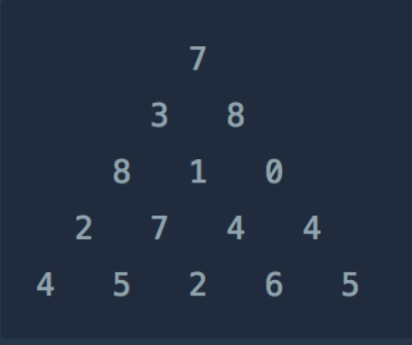
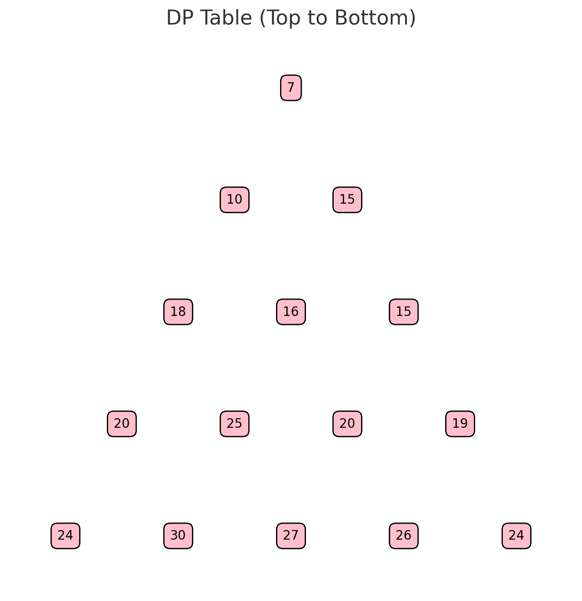
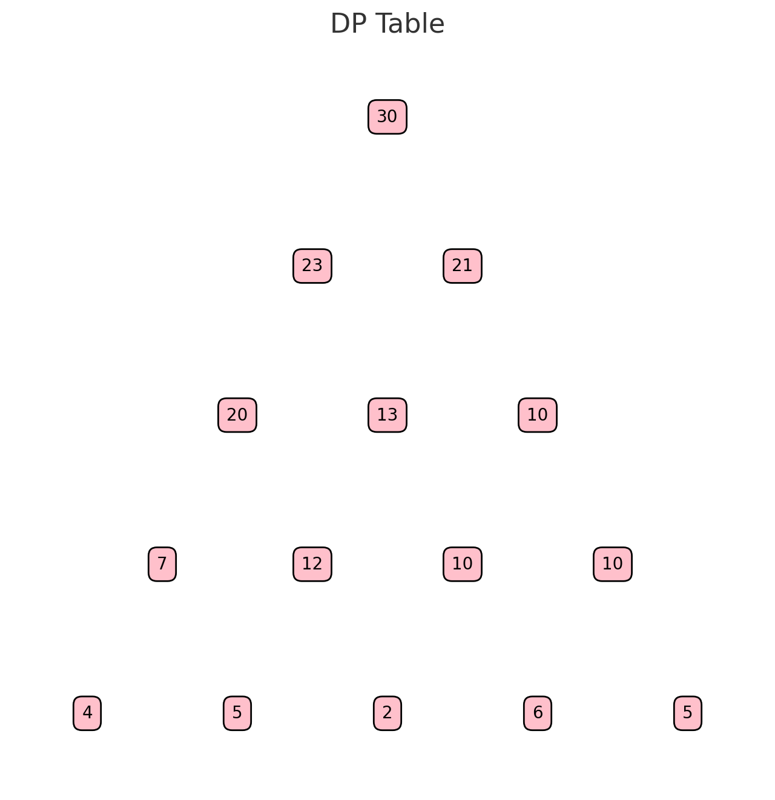

# 정수 삼각형

동적계획법(Dynamic Programming) > 정수 삼각형

문제 링크: https://school.programmers.co.kr/learn/courses/30/lessons/43105

- 다른 사람 풀이 보고 위 -> 아래, 아래 -> 위 순서로 처리하는 걸로 작성
- 738.., 731.., 781.., 780.. 이렇게 증가하면서 양옆에 가운데에 위치한 숫자는 양옆을 비교해서 큰수를 표시한다.
- 나는 두 번째 기준에서 3+8, 3+1 // 8+1, 8+0을 각각 비교해서 큰수를 두는 줄 알고 헤맸다. 단순히 줄만 그어보면 3+8 // 3+1, 8+1 // 8+0 이렇게 되어야 했는데..

---
- chat gpt 그림 감사
- 순서를 그리면 이렇게 된다.

<br>



```java
public static int downTest(int[][] triangle) {
        int[][] arr = new int[triangle.length][triangle.length];
        
        arr[0][0] = triangle[0][0];
        
        for (int i = 1; i < triangle.length; i++) {
            for (int j = 0; j < triangle[i].length; j++) {                
                if (j == 0) {
                    arr[i][j] = arr[i-1][j] + triangle[i][j];
                } else {
                    arr[i][j] = Math.max(arr[i-1][j-1] + triangle[i][j], arr[i-1][j] + triangle[i][j]);
                }
            }
        }
        
        int answer = 0;
        for (int v : arr[arr.length - 1]) {
            answer = Math.max(answer, v);
        }
        
        return answer;
    }   

    public static int upTest(int[][] triangle) {
        int answer = 0;
        
        for (int i = triangle.length - 2; i >= 0; i--) {
            for (int j = 0; j < triangle[i].length; j++) {
                triangle[i][j] = Math.max(triangle[i+1][j] + triangle[i][j], triangle[i+1][j+1] + triangle[i][j]);
            }
        }        
        
        return answer;
    }
```
