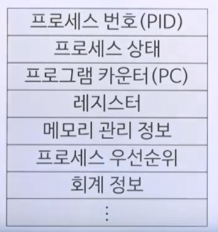

# AOP

### 출처: 코드로 배우는 스프링 웹프로젝트

---

Srping version: 5.0.7.RELEASE

xml

```xml
<org.aspectj-version>1.9.0</org.aspectj-version>
<dependency>
    <groupId>org.aspectj</groupId>
    <artifactId>aspectjrt</artifactId>
    <version>${org.aspectj-version}</version>
</dependency>
<dependency>
    <groupId>org.aspectj</groupId>
    <artifactId>aspectjweaver</artifactId>
    <version>${org.aspectj-version}</version>
</dependency>

root-context.xml
<context:annotation-config></context:annotation-config>
<context:component-scan base-package="org.zerock.aop"></context:component-scan>
<aop:aspectj-autoproxy></aop:aspectj-autoproxy>
```

source

```java
public interface SampleService {
    public Integer doAdd(String str1, String str2) throws Exception;
}

@Service
public class SampleServiceImpl implements SampleService {
    @Override
    public Integer doAdd(String str1, String str2) throws Exception {
        return Integer.parseInt(str1) + Integer.parseInt(str2);
    }
}


// package org.zerock.aop;
@Aspect
@Log4j
@Component
public class LogAdvice {
    @Before("execution (* org.zerock.service.SampleService*.*(..))")
    public void logBefore() {
        log.info("==============================================");
    }

    @Before("execution (* org.zerock.service.SampleService*.doAdd(String, String)) && args(str1, str2)")
    public void logBeforeWithParam(String str1, String str2) {
        log.info(str1 + "/" + str2);
    }

    @AfterThrowing(pointcut = "execution(* org.zerock.service.SampleService*.*(..))", throwing="exception")
    public void logException(Exception exception) {
        log.info("exception/" + exception);
    }

    @Around("execution(* org.zerock.service.SampleService*.*(..))")
    public Object logTime(ProceedingJoinPoint pjp) {
       long start = System.currentTimeMillis();

       log.info("target: " + pjp.getTarget());
       log.info("param: " + Arrays.toString(pjp.getArgs()));

       Object result = null;

       try {
           result = pjp.proceed();
       } catch (Throwable e) {
           e.printStackTrace();
       }

       long end = System.currentTimeMillis();

       log.info("TIME: " + (end - start));

       return result;

    }
}

//exception 발생하는 케이스, logTime는 미사용
//logTime 사용 시 printStackTrace 에서 처리되어 logException 메소드는 타지 않음
INFO : org.zerock.aop.LogAdvice - ============================================== -> logBefore
INFO : org.zerock.aop.LogAdvice - 12/45s6 -> logBeforeWithParam
INFO : org.zerock.aop.LogAdvice - exception/java.lang.NumberFormatException: For input string: "45s6" -> logException

//정상적으로 처리 되었을 때 결과
INFO : org.zerock.aop.LogAdvice - target: org.zerock.service.SampleServiceImpl@64da2a7 -> logTime
INFO : org.zerock.aop.LogAdvice - param: [12, 456] -> logTime
INFO : org.zerock.aop.LogAdvice - ==============================================      -> logBefore
INFO : org.zerock.aop.LogAdvice - 12/456 -> logBeforeWithParam
INFO : org.zerock.aop.LogAdvice - TIME: 6 -> logTime
```

